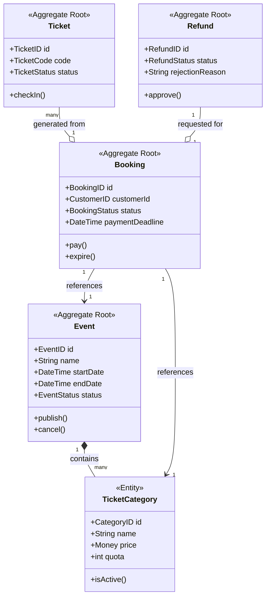

# Project Structural

This document defines the shared language used by both the business stakeholders and the development team. Adhering to this glossary ensures consistency across the requirements, the domain model, and the implementation code.

---

## 1. Domain Business Terms

These terms represent the core concepts and real-world entities of the **Event Ticketing & Booking System**.

| Term | Meaning |
| :--- | :--- |
| **Event** | An activity organized by an Event Organizer and attended by customers. |
| **Event Organizer** | A user who creates and manages events, ticket categories, and refunds. |
| **Customer** | A user who browses events, creates bookings, and purchases tickets. |
| **Gate Officer** | A user who validates unique ticket codes during event check-in. |
| **System Admin** | A user responsible for triggering refund payouts and monitoring operations. |
| **Ticket Category** | A specific type of ticket (e.g., Regular, VIP) with its own price and quota. |
| **Quota** | The maximum number of tickets available within a specific ticket category. |
| **Booking** | A temporary reservation of tickets before payment is finalized. |
| **Ticket** | Official proof of attendance generated only after a booking is successfully paid. |
| **Ticket Code** | A unique identifier used to validate a ticket at the venue. |
| **Check-in** | The process of validating a ticket when a participant enters the event. |
| **Refund** | The process of returning money to a customer for a cancelled or requested booking. |
| **Sales Period** | The timeframe during which a specific ticket category is available for purchase. |
| **Payment Deadline** | The time limit (e.g., 15 minutes) to pay for a booking before it expires. |

---

## 2. Technical & Architectural Terms (DDD)

These terms represent the architectural patterns and components required for the **Clean Architecture** and **Domain-Driven Design** implementation.

| Term | Meaning in Implementation |
| :--- | :--- |
| **Aggregate** | A cluster of domain objects treated as a single unit for data changes. |
| **Entity** | A domain object with a unique identity that persists over time. |
| **Value Object** | An object defined only by its attributes with no unique identity (e.g., `Money`). |
| **Domain Event** | A notification of a significant change within the domain logic. |
| **Repository** | An interface for persisting and retrieving Aggregates from the database. |
| **Domain Service** | Business logic that doesn't naturally belong inside a single Entity or Aggregate. |
| **Command** | An object representing an intent to change the state of the system. |
| **Query** | An object representing a request to retrieve data without changing it. |
| **Handler** | The specific logic that executes a Command or a Query. |
| **DTO** | Data Transfer Object used to move data between layers. |

---

## 3. Domain Model

### Class Diagram



---

### Structural Breakdown

This list provides the descriptive detail your lecturers will look for to ensure you understand DDD Tactical Patterns.

#### A. Aggregates & Entities

**Event Aggregate**
- Root Entity: `Event`
- Internal Entity: `TicketCategory` (Managed by the Event Organizer)
- State: `Draft`, `Published`, `Cancelled`, `Completed`

**Booking Aggregate**
- Root Entity: `Booking`
- Responsibility: Manages the reservation lifecycle and total price calculation
- State: `PendingPayment`, `Paid`, `Expired`, `Refunded`

**Ticket Aggregate**
- Root Entity: `Ticket`
- Responsibility: Used by the Gate Officer for entry validation

**Refund Aggregate**
- Root Entity: `Refund`
- Responsibility: Tracks the lifecycle of a refund request from Customer to Admin

#### B. Value Objects

| Value Object | Description |
| :--- | :--- |
| **Money** | Encapsulates `amount` (decimal) and `currency` (string) to prevent logic errors in calculations. |
| **TicketCode** | A unique string value used for validation. |
| **Capacity** | Represents the total allowed attendees for an Event. |

#### C. Domain Events

These represent significant changes in state that trigger side effects (like sending notifications or updating quotas).

| Aggregate | Domain Events |
| :--- | :--- |
| Event | `EventCreated`, `EventPublished`, `EventCancelled` |
| Booking | `TicketReserved` *(raised when a Booking is created)*, `BookingPaid`, `BookingExpired` |
| Ticket | `TicketCheckedIn` |
| Refund | `RefundRequested`, `RefundApproved`, `RefundPaidOut` |

---

## 4. Repository Interfaces (Infrastructure Layer Definition)

These interfaces define how your Aggregates will be persisted in PostgreSQL.

| Interface | Methods |
| :--- | :--- |
| **IEventRepository** | `save(Event)`, `findById(EventID)` |
| **IBookingRepository** | `save(Booking)`, `findActiveByCustomer(CustomerID)` |
| **IRefundRepository** | `save(Refund)`, `findPending()` |

This setup clearly shows the separation between the **Domain Layer** (Logic) and the **Infrastructure Layer** (Database), which is the core of Clean Architecture.

---

## 5. Initial Business Rules

### Event & Ticket Rules
- **Events** must have valid dates and capacity > 0.
- **Draft** events can be **Published** if they have active ticket categories and valid quotas.
- **Published** events can be **Cancelled** (triggering refunds).
- **Ticket Categories** need a valid price, quota > 0, and sales period ending before the event.
- Total ticket quota cannot exceed event capacity.

### Booking & Payment Rules
- **Bookings** require a published event, active category, and valid quantity within remaining quota.
- Customers can only have 1 active booking per event.
- Bookings start as **PendingPayment**.
- If paid exactly within the deadline, status becomes **Paid** and tickets are issued.
- If unpaid past deadline, status becomes **Expired** and quota is released.

### Check-in & Refund Rules
- **Check-in** requires an active ticket for the correct event and time. Tickets can only be used once.
- **Refunds** can be requested for paid, unchecked-in bookings before the deadline (or anytime if event is cancelled).
- Refunds go through **Requested** -> **Approved** / **Rejected** -> **PaidOut**.
- Approved refunds cancel related tickets and bookings.

---

## 6. Folder Structure

```plaintext
src/
├── domain/                    # Enterprise Business Rules (Layer 1)
│   ├── aggregates/            # Event, Booking, Ticket, and Refund Aggregates
│   ├── entities/              # Domain Entities with unique identities
│   ├── value-objects/         # Money, TicketCode, and Capacity
│   ├── events/                # Domain Events (EventCreated, BookingPaid, etc.)
│   ├── repositories/          # Repository Interfaces (IEventRepository, etc.)
│   ├── factories/             # Contains logic for creating complex Aggregates or Entities
│   └── services/              # Domain Services for cross-aggregate logic
│
├── application/               # Application Business Rules (Layer 2)
│   ├── commands/              # Command definitions (intent to change state)
│   ├── queries/               #Handles read-only operations that retrieve data for the UI without modifying the      │   │                           system state.
│   ├── dtos/                  # Data Transfer Objects for Application Layer
│
├── infrastructure/            # Frameworks & Drivers (Layer 3)
│   ├── persistence/           # PostgreSQL Implementation (Prisma/TypeORM)
│   │   ├── entities/          # Database schemas/models
│   │   ├── repositories/      # Repository implementations
│   │   └── migrations/        # PostgreSQL migration files
│   ├── services/              # Implementations of the application service interfaces
│
├── presentation/              # Delivery Mechanism (Layer 4)
│   └── http/                  # The entry point for web-based interactions
│       ├── controllers/       # NestJS REST API Controllers
│       └── modules/           # NestJS-specific wiring that bundles controllers and providers for each feature
│
└── test/                      # Mandatory Domain Unit Tests
    └── unit/                  # Unit tests for domain logic and business rules
```
