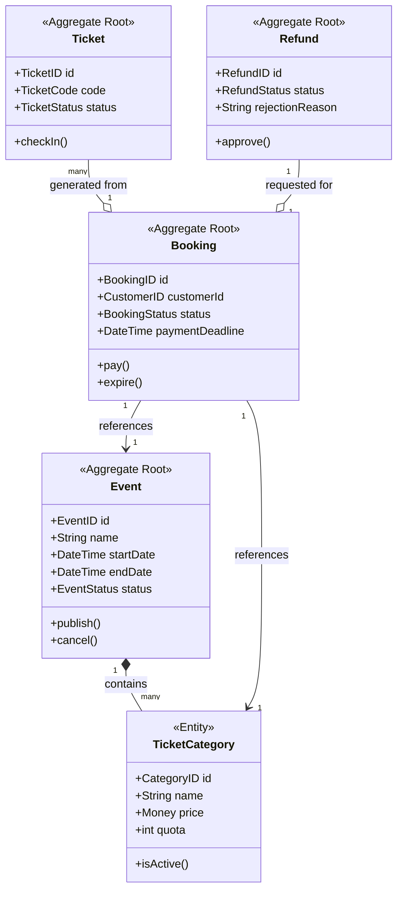

***

# Event Management System: Domain and Architectural Specification

This project implements an Event Ticketing & Booking System using **Clean Architecture** and **Domain-Driven Design (DDD)** tactical patterns[cite: 1]. The primary goal is to maintain a high degree of maintainability and testability by decoupling the core business logic from external infrastructure[cite: 1].

---

## 1. Ubiquitous Language Glossary

This glossary defines the shared language used to ensure consistency between the business requirements and the technical implementation[cite: 1].

### Domain Business Terms
| Term | Description |
| :--- | :--- |
| **Event** | A planned activity managed by an Organizer and attended by Customers[cite: 1]. |
| **Booking** | A temporary reservation of tickets pending successful payment[cite: 1]. |
| **Ticket Category** | Distinct ticket types (e.g., VIP, Regular) with specific pricing and quotas[cite: 1]. |
| **Quota** | The maximum allowable ticket sales for a specific category[cite: 1]. |
| **Check-in** | The process of validating a Ticket Code at the event venue[cite: 1]. |
| **Money** | A value object representing a numeric amount and its associated currency[cite: 1]. |
| **Payment Deadline** | The expiration window (e.g., 15 minutes) for a pending booking[cite: 1]. |

### Technical & Architectural Terms
| Term | Implementation Meaning |
| :--- | :--- |
| **Aggregate** | A cluster of domain objects treated as a single unit for data consistency[cite: 1]. |
| **Domain Event** | An asynchronous notification of a significant state change (e.g., `EventPublished`)[cite: 1]. |
| **Repository** | An interface defining how Aggregates are persisted to the PostgreSQL database[cite: 1]. |
| **Command/Query** | Patterns used to separate the intent to change state from the request to read data[cite: 1]. |

---

## 2. Initial Domain Model Draft

The following diagram illustrates the relationships between the identified Aggregate Roots, Entities, and Value Objects[cite: 1].

---

## 3. Structural Breakdown

### A. Aggregates and Entities
*   **Event Aggregate**[cite: 1]:
    *   **Root Entity**: `Event`[cite: 1].
    *   **Internal Entity**: `TicketCategory`[cite: 1].
    *   **States**: `Draft`, `Published`, `Cancelled`, `Completed`[cite: 1].
*   **Booking Aggregate**[cite: 1]:
    *   **Root Entity**: `Booking`[cite: 1].
    *   **Responsibility**: Encapsulates the logic for price calculation and the payment lifecycle[cite: 1].
*   **Ticket Aggregate**[cite: 1]:
    *   **Root Entity**: `Ticket`[cite: 1].
    *   **Responsibility**: Manages unique ticket codes and entry validation[cite: 1].
*   **Refund Aggregate**[cite: 1]:
    *   **Root Entity**: `Refund`[cite: 1].
    *   **Responsibility**: Manages the approval/rejection lifecycle for customer refund requests[cite: 1].

### B. Value Objects
*   **Money**: Ensures consistent currency handling and prevents precision errors[cite: 1].
*   **TicketCode**: A unique, validated identifier for event entry[cite: 1].
*   **Capacity**: Validates that ticket quotas do not exceed total venue limits[cite: 1].

### C. Domain Events
Domain events facilitate decoupling by allowing the system to react to changes without direct dependencies[cite: 1]:
*   `EventPublished`: Triggered when an event moves from Draft to Published[cite: 1].
*   `TicketReserved`: Raised upon initial booking creation[cite: 1].
*   `BookingPaid`: Triggers the generation of unique tickets[cite: 1].
*   `BookingExpired`: Releases reserved quota back to the ticket category[cite: 1].

---

## 4. Repository Interfaces
These interfaces reside in the Domain/Application layer and are implemented in the Infrastructure layer using PostgreSQL[cite: 1].

*   `IEventRepository`: Persistence for event and ticket category data[cite: 1].
*   `IBookingRepository`: Management of customer bookings and payment status[cite: 1].
*   `IRefundRepository`: Tracking and processing of refund requests[cite: 1].

***

To complete your Week 8 deliverables, would you like to draft the **Initial Business Rules** based on the acceptance criteria found in the project documentation?[cite: 1]
