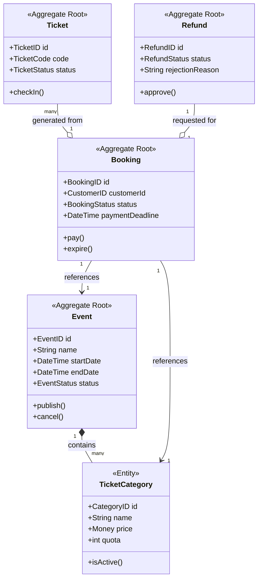

# Ubiquitous Language Glossary

This document defines the shared language used by both the business stakeholders and the development team. Adhering to this glossary ensures consistency across the requirements, the domain model, and the implementation code.

## 1. Domain Business Terms
These terms represent the core concepts and real-world entities of the **Event Ticketing & Booking System**.

| Term | Meaning |
| :--- | :--- |
| **Event** | An activity organized by an Event Organizer and attended by customers. |
| **Event Organizer** | A user who creates and manages events, ticket categories, and refunds. |
| **Customer** | A user who browses events, creates bookings, and purchases tickets. |
| **Gate Officer** | A user who validates unique ticket codes during event check-in. |
| **System Admin** | A user responsible for triggering refund payouts and monitoring operations. |
| **Ticket Category** | A specific type of ticket (e.g., Regular, VIP) with its own price and quota. |
| **Quota** | The maximum number of tickets available within a specific ticket category. |
| **Booking** | A temporary reservation of tickets before payment is finalized. |
| **Ticket** | Official proof of attendance generated only after a booking is successfully paid. |
| **Ticket Code** | A unique identifier used to validate a ticket at the venue. |
| **Check-in** | The process of validating a ticket when a participant enters the event. |
| **Refund** | The process of returning money to a customer for a cancelled or requested booking. |
| **Sales Period** | The timeframe during which a specific ticket category is available for purchase. |
| **Payment Deadline** | The time limit (e.g., 15 minutes) to pay for a booking before it expires. |

## 2. Technical & Architectural Terms (DDD)
These terms represent the architectural patterns and components required for the **Clean Architecture** and **Domain-Driven Design** implementation.

| Term | Meaning in Implementation |
| :--- | :--- |
| **Aggregate** | A cluster of domain objects treated as a single unit for data changes. |
| **Entity** | A domain object with a unique identity that persists over time. |
| **Value Object** | An object defined only by its attributes with no unique identity (e.g., `Money`). |
| **Domain Event** | A notification of a significant change within the domain logic. |
| **Repository** | An interface for persisting and retrieving Aggregates from the database. |
| **Domain Service** | Business logic that doesn't naturally belong inside a single Entity or Aggregate. |
| **Command** | An object representing an intent to change the state of the system. |
| **Query** | An object representing a request to retrieve data without changing it. |
| **Handler** | The specific logic that executes a Command or a Query. |
| **DTO** | Data Transfer Object used to move data between layers. |

